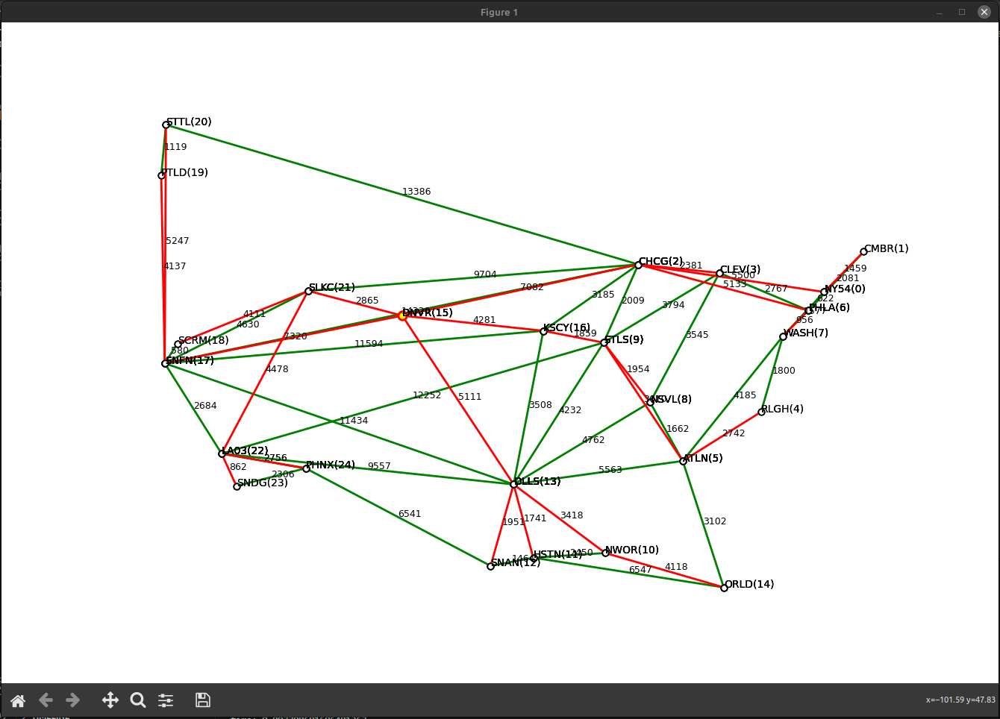

## Построение сети управления для SDN сети
Язык программирования: Python \
Поддерживаемый формат файлов топологии: .gml (примеры топологий в папке ```./topology```)

### Список библиотек, используемых в реализации
* ```argparse``` – парсинг аргументов командной строки
* ```csv``` – формирование csv-файлов
* ```gml``` – пользовательская библиотека, используемая для парсинга gml-файлов топологий ([источник](https://github.com/icasdri/gml.py))
* ```math``` – математические операции
* ```matplotlib``` – визуализация топологии
* ```time``` – подсчет времени работы алгоритма поиска кратчайших путей
* ```tqdm``` – консольная визуализация процесса работы этого алгоритма

### Установка зависимостей
Для корректной работы программы (в частности, при использовании интерпретатора ```/bin/python3```) должны быть установлены библиотеки ```matplotlib``` и ```tqdm```. \
Необходимо выполнить в терминале следующие команды:
```
pip install matplotlib
pip install tqdm
```

### Запуск программы
Необходимо выполнить скрипт sdn_main.py (по умолчанию используется интерпретатор ```/bin/python3```). Остальные скрипты должны находиться в той же директории!

Аргументы:
* ```-h``` – вывод сообщения с описанием флагов и завершение программы
* ```-t [путь/к/файлу]``` – указание пути к gml-файлу топологии (обязательный аргумент)
* ```-k [номер_критерия]``` – номер критерия, используемого при расчете кратчайших путей: '1' - задержка до самого дальнего контроллера минимальна, '2' - суммарная длина ребер SDN сети минимальна + критерий '1'
* ```-v``` – активация визуализации. В конце выполнения программы появится окно с визуализированной топологией, как на изображении ниже. Красным цветом выделяются ребра, принадлежащие остовному дереву сети управления, желтым цветом с красной обводкой выделяется узел с SDN-контроллером. Возле каждого ребра указана задержка соответствующего соединения. Визуализацию можно масштабировать и передвигать с помощью инструментов на панели окна.



Пример запуска программы:
```
./sdn_main.py -t tests/AttMpls.gml -k 1 -v
```

Программа выводит на стандартный поток прогресс работы алгоритма поиска кратчайших путей (одна итерация – один завершенный алгоритм Дейкстры) и суммарное время, которое потребовалось на выполнение всех итераций.

Пример вывода:
```
25it [00:00, 9303.31it/s]
time: 0.0051991939544677734
```

Для удобства выходные csv-файлы сохраняются в папке ```./tests```.

**WARNING:** программа не обрабатывает узлы из топологии без атрибутов Latitude и Longitude, а также ребра, инцидентные данным узлам. Однако если случится так, что узлы разобьются на несколько компонент связности вследствие того, что единственное соединение между этими компонентами было через необработанные вершины, то (по естественным причинам) программа выдаст исключение! Будьте внимательны при выборе/составлении топологий для обработки.

### Небольшая сводка о наблюдениях
При реализации механики узлов и соединений было решено создать классы ```NetNode``` и ```NetEdge```, первый из которых содержит ссылки на объекты ```NetEdge```, соответствующие соединениям, выходящих из данного узла, а второй – ссылки на объекты ```NetNode```, соответствующие концам данного соединения. Благодаря этому отпала необходимость проходиться по всему списку узлов/соединений при поиске объектов инцидентных ребер/концов ребра, поскольку ссылки на все необходимые структуры уже хранятся в объекте.

Улучшение алгоритма Дейкстры с помощью калибровки дало значительный прирост в производительности (практически в 3 раза). Например, для топологии TataNld.gml до имплементации калибровки вывод программы был таким:
```
143it [00:00, 443.60it/s]
time: 0.325192928314209
```

После имплементации наблюдалось заметное улучшение времени работы:
```
143it [00:00, 1133.36it/s]
time: 0.12871742248535156
```

Реализация обычного алгоритма Дейкстры с одноуровневыми корзинами без калибровки приведена в файле alg_without_caliber.py, с калибровкой – в файле algorithm.py (используемом в программе).
